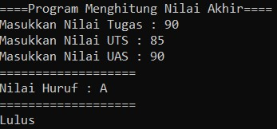
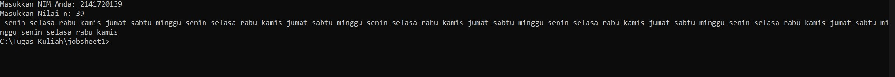
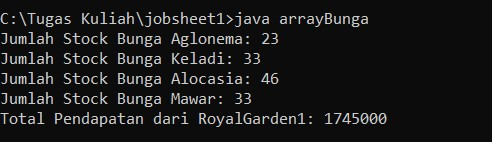
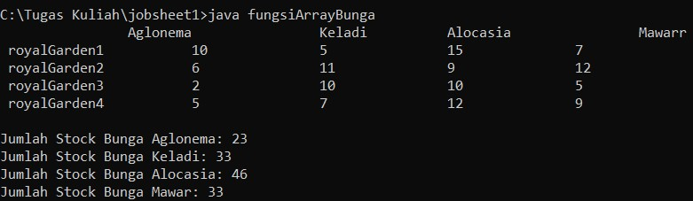
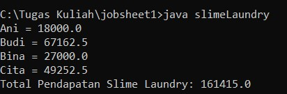
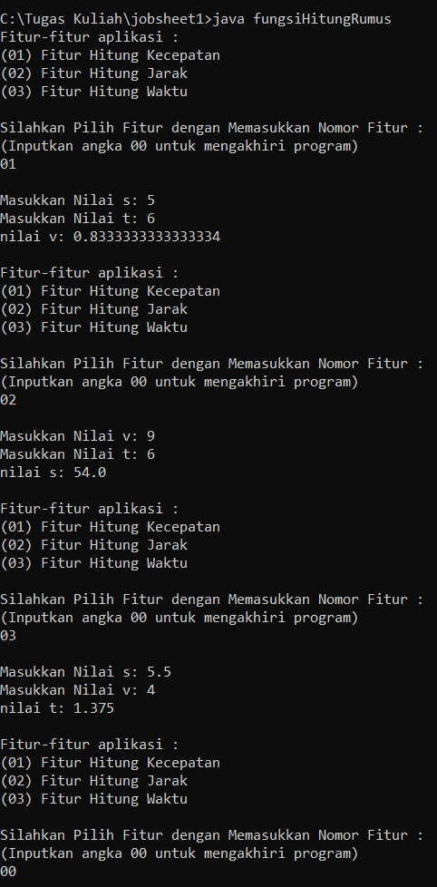

# Laporan Praktikum Pertemuan 1

## Output Program 

1. Pemilihan Nilai Akhir

 

2. Perulangan NIM

3. Array Bunga

4. Fungsi Array Bunga

5. Tugas 1 (Slime Laundry)

6. Tugas 2 (Fungsi Hitung Rumus)

