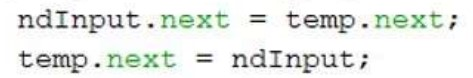
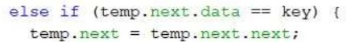
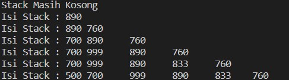
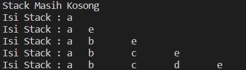
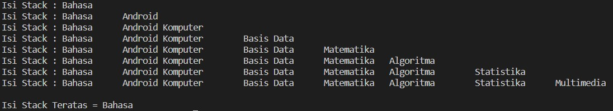
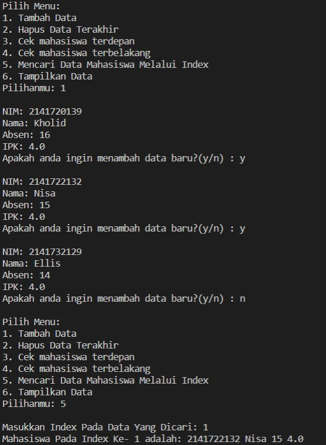
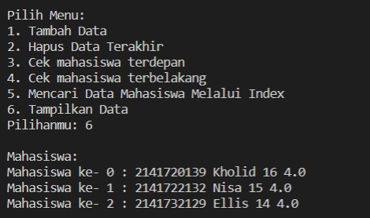

# Laporan Praktikum Jobsheet 11
### Kholid Maulidi
### 1G/ 16/ 2141720139

## subbab 2.1.1

1. Mengapa hasil compile kode program di baris pertama menghasilkan “Linked List Kosong”?
*  Karena Linked List masih belum diisi data apapun 

2. Pada step 10, jelaskan kegunaan kode berikut

* Sebagai lokasi adInput next untuk memindahkan dan menyimpan data dalam 
lokasi temp.next dan lokasi temp.next kemudian digunakan memasukkan node dengan 
data input

3. Perhatikan class SingleLinkedList, pada method insertAt Jelaskan kegunaan kode 
berikut

* Jika lokasi di temp.next next == null atau kosong, tail node paling belakang = 
lokasi temp.next

## subbab 2.2.3

1. Mengapa digunakan keyword break pada fungsi remove? Jelaskan!
* Agar setelah menghapus atau mengeksekusi perintah selesai langsung berhenti

2. Jelaskan kegunaan kode dibawah pada method remove

* Jika data pada lokasi temp.next sama dengan key maka lokasi temp.next = 
temp.next.next 

3. Apa saja nilai kembalian yang dapat dikembalikan pada method indexOf? Jelaskan 
maksud masing-masing kembalian tersebut!
- -1 dan index. 
- -1 : jika data kosong atau data tidak ada. 
- Index : Jika data ada dan yang di outputkan letak index dari data yang dicari

## Tugas

1. 
        
        public void insertBefore(int key, int input){
            Node ndInput = new Node(input, null);
            Node temp = head;
            do{
                if(temp.data == key){
                    this.addFirst(input);
                    break;
                }else if(temp.next.data == key){
                    ndInput.next = temp.next;
                    temp.next = ndInput;
                    break;
                }
                temp = temp.next;
            }while(temp != null);
        }

2. 
**Class Node**

    char data;
    Node next;

    public Node(int nilai,Node berikutnya){
        this.data = nilai;
        this.next = berikutnya;
    }
    
**Class SingleLinkedList**

    Node head; 
    Node tail;

    void addFirst(char input){
        Node ndInput = new Node(input, null);
        if(isEmpty()){//jika linked list kosong
            head = ndInput; //head dan tail sama dengan node input
            tail = ndInput;
        }else{
            ndInput.next = head;
            head = ndInput;
        }
    }

    void addLast(char input){
        Node ndInput = new Node(input, null);
        if(isEmpty()){
            head = ndInput;//head dan tail sama dengan node input
            tail = ndInput;
        }else{
            tail.next = ndInput;
            tail = ndInput;
        }
    }

    void insertAfter(char key, char input){
        Node ndInput = new Node(input, null);
        Node temp = head;
        do{
            if(temp.data == key){
                ndInput.next = temp.next;
                temp.next = ndInput;
                if(ndInput.next == null) tail=ndInput;
                break;
            }
            temp = temp.next;
        }while(temp != null);
    }

    void insertAt(int index, char input){
        if(index < 0){
            System.out.println("indeks salah");
        }else if(index == 0){
            addFirst(input);
        }else{
            Node temp = head;
            for(int i = 0; i < index - 1; i++){
                temp = temp.next;
            }
            temp.next = new Node(input, temp.next);
            if(temp.next.next == null) tail=temp.next;
        }
    }

    void insertBefore(int key, char input){
        Node ndInput = new Node(input, null);
        Node temp = head;
        do{
            if(temp.data == key){
                this.addFirst(input);
                break;
            }else if(temp.next.data == key){
                ndInput.next = temp.next;
                temp.next = ndInput;
                break;
            }
            temp = temp.next;
        }while(temp != null);
    }
**Main**

    singLL.print();
        singLL.addFirst('a');
        singLL.print();
        singLL.addLast('e');
        singLL.print();
        singLL.insertAfter('a', 'b');
        singLL.print();
        singLL.insertAt(2, 'c');
        singLL.print();
        singLL.insertAfter('c', 'd');
        singLL.print();

3. 
**Class Node**

        String data;
    Node next; 

    public Node(String data, Node berikutnya){
        this.data = data;
        this.next = berikutnya;
    } 

**Class SingleLinkedList**

    Node head; 
    Node tail; 
    
    public boolean isEmpty(){
        return head == null;
    }
    
    public void print(){
        if(!isEmpty()){
            Node tmp = head;
            //System.out.print("Isi Linked List : \t");
            System.out.print("Isi Stack : ");
            while(tmp != null){
                System.out.print(tmp.data + "\t");
                tmp = tmp.next;
            }
            System.out.println("");
        }else{
            //System.out.println("Linked list kosong");
            System.out.println("Stack Masih Kosong");
        }
    }

    public void peek(){
        if(!isEmpty()){
            Node tmp = head;
            while(tmp != null){
                if(tmp == head){
                    System.out.println("Isi Stack Teratas = " + tmp.data);
                }
                tmp = tmp.next;
            }
        }else{
            System.out.println("Stack Masih Kosong");
        }
    }

    public void push(String input){
        Node ndInput = new Node(input, null);
        if(isEmpty()){
            head = ndInput;
            tail = ndInput;
        }else{
            tail.next = ndInput;
            tail = ndInput;
        }
    }
    
    public void pop(){
        if(isEmpty()){
            System.out.println("Stack Masih Kosong, tidak dapat dihapus!");
        }else if(head == tail){
            head = tail = null;
        }else{
            Node temp = head;
            while(temp.next != tail){
                temp = temp.next;
            }
            temp.next = null;
            tail = temp;
        }
    }

**Main** 

        singLL.push("Bahasa");
        singLL.print();
        singLL.push("Android");
        singLL.print();
        singLL.push("Komputer");
        singLL.print();
        singLL.push("Basis Data");
        singLL.print();
        singLL.push("Matematika");
        singLL.print();
        singLL.push("Algoritma");
        singLL.print();
        singLL.push("Statistika");
        singLL.print();
        singLL.push("Multimedia");
        singLL.print();
        System.out.println();
        singLL.peek();

4. 

    package Tugas.Nomor4;

    import java.util.Scanner;
    class NodeMahasiswa {
        String nim, nama;
        int absen;
        double ipk;
        NodeMahasiswa next;
        
        NodeMahasiswa(String nim, String nama, int absen, double ipk, NodeMahasiswa berikutnya){
            this.nim = nim;
            this.nama = nama;
            this.absen = absen;
            this.ipk = ipk;
            this.next = berikutnya;
        }
    }

    class SLLMahasiswa {
        NodeMahasiswa head;
        NodeMahasiswa tail;
        
        public boolean isEmpty(){
            return head == null;
        }
        public void print(){
            if (!isEmpty()){
                NodeMahasiswa tmp = head;
                int urut = 0;
                System.out.println("Mahasiswa: ");
                while (tmp != null){
                    System.out.println("Mahasiswa ke- " + urut + " : " + tmp.nim + " " + tmp.nama + " " + tmp.absen + " " + tmp.ipk);
                    tmp = tmp.next;
                    urut++;
                }
            } else{
                System.out.println("Antrian Masih Kosong");
            }
        }
        public void antrianDepan(){
            if (!isEmpty()){
                NodeMahasiswa tmp = head;
                System.out.println("Mahasiswa Terdepan : " + tmp.nim + " " + tmp.nama + " " + tmp.absen + " " + tmp.ipk);
            } else{
                System.out.println("Antrian Masih Kosong");
            }
        }
        public void antrianBelakang(){
            if (!isEmpty()){
                NodeMahasiswa tmp = head;
                while (tmp != null){
                    if (tmp == tail){
                        System.out.println("Mahasiswa Terbelakang : " + tmp.nim + " " + tmp.nama + " " + tmp.absen + " " + tmp.ipk);
                    }
                    tmp = tmp.next;
                }
            } else{
                System.out.println("Antrian Masih Kosong");
            }
        }
        public void tambahData(String nim, String nama, int absen, double ipk){
            NodeMahasiswa ndInput = new NodeMahasiswa (nim, nama, absen, ipk, null);
            if (isEmpty()){
                head = ndInput;
                tail = ndInput;
            } else{
                tail.next = ndInput;
                tail = ndInput;
            }
        }
        public void cariDataIndex(int index){
            if (isEmpty()){
                System.out.println("Antrian Masih Kosong");
            } else{
                NodeMahasiswa tmp = head;
                for (int i = 0; i < index; i++){
                    tmp = tmp.next;
                }
                System.out.println("Mahasiswa Pada Index Ke- " + index + " adalah: " + tmp.nim + " " + tmp.nama + " " + tmp.absen + " " + tmp.ipk);
            }
        }
        public void remove(){
            if (isEmpty()){
                System.out.println("Antrian Masih Kosong, Tidak Dapat Dihapus!");
            } else if (head == tail){
                head = tail = null;
            } else{
                NodeMahasiswa temp = head;
                while (temp.next != tail){
                    temp = temp.next;
                }
                temp.next = null;
                tail = temp;
            }
        }
    }

    public class SLLMahasiswaMain{
        public static void main(String[] args){
            SLLMahasiswa sll = new SLLMahasiswa();
            Scanner sc = new Scanner (System.in);
            Scanner in = new Scanner (System.in);
            char pilih;
            int menu;
            do{
                System.out.println("Pilih Menu:");
                System.out.println("1. Tambah Data");
                System.out.println("2. Hapus Data Terakhir");
                System.out.println("3. Cek mahasiswa terdepan");
                System.out.println("4. Cek mahasiswa terbelakang");
                System.out.println("5. Mencari Data Mahasiswa Melalui Index");
                System.out.println("6. Tampilkan Data");
                System.out.print("Pilihanmu: ");
                menu = sc.nextInt();
                System.out.println("");
                
                switch(menu){
                    case 1:{
                        do{
                            System.out.print("NIM: ");
                            String nim = sc.next();
                            System.out.print("Nama: ");
                            String nama = sc.next();
                            System.out.print("Absen: ");
                            int absen = sc.nextInt();
                            System.out.print("IPK: ");
                            double ipk = sc.nextDouble();
                            System.out.print("Apakah anda ingin menambah data baru?(y/n) : ");
                            pilih = sc.next().charAt(0);
                            sll.tambahData(nim, nama, absen, ipk);
                            System.out.println("");
                        } while (pilih == 'y' || pilih == 'Y');
                    } 
                    break;
                    case 2:{
                        sll.remove();
                        System.out.println("");
                    }
                    break;
                    case 3:{
                        sll.antrianDepan();
                        System.out.println("");
                    }
                    break;
                    case 4:{
                        sll.antrianBelakang();
                        System.out.println("");
                    }
                    break;
                    case 5:{
                        System.out.print("Masukkan Index Pada Data Yang Dicari: ");
                        int idx = sc.nextInt();
                        sll.cariDataIndex(idx);
                        System.out.println("");
                    }
                    break;
                    case 6:{
                        sll.print();
                        System.out.println("");
                    }
                    break;
                }
            } while (menu > 0 && menu < 6);
        }
    }

