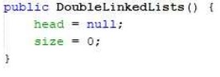
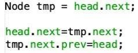
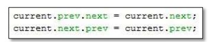
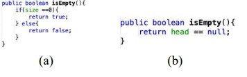
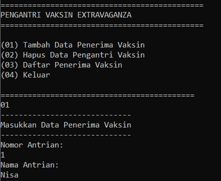
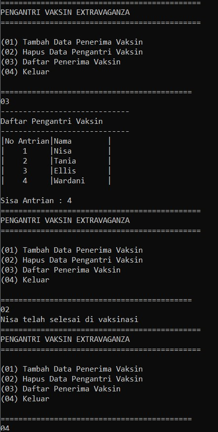
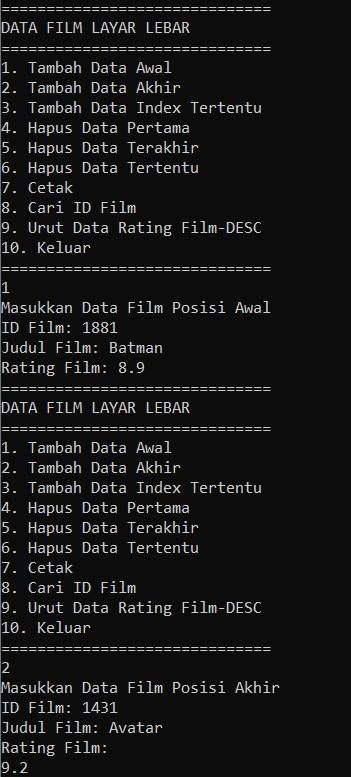
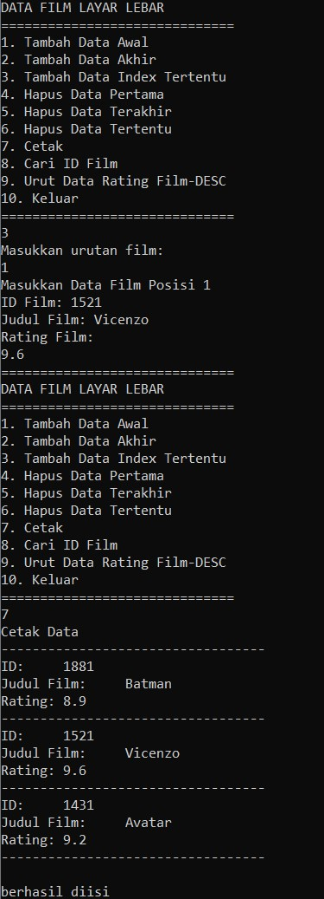
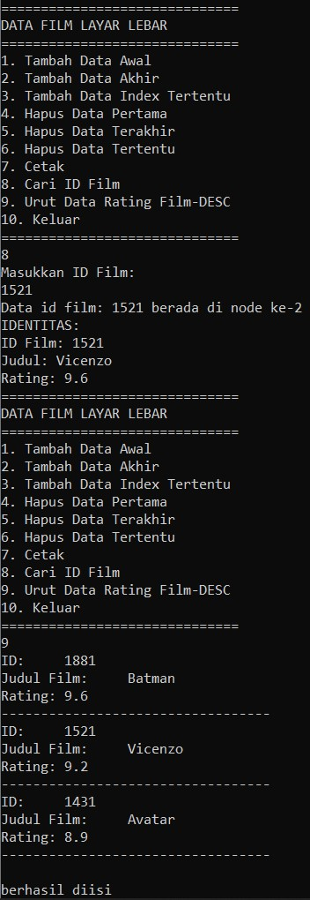
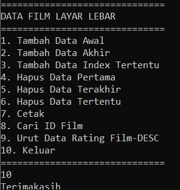

# Laporan Praktikum Jobsheet 12
### Kholid Maulidi
### 1G/ 16/ 2141720139

## subbab 12.2.3

1. Jelaskan perbedaan antara single linked list dengan double linked lists!
* Perbedaan antara single linked list dengan double linked list yakni hanya 
terletak pada pointernya saja, pada single linked list pointer hanya ada 1 yaitu next, 
sementara pada double linked list ada 2 pointer yakni next dan previsious/prev 

2. Perhatikan class Node, didalamnya terdapat atribut next dan prev. Untuk 
apakah atribut tersebut?
* Atribut next berguna untuk menunjuk kepada node berikutnya, dan atribut 
prev berguna untuk menunjuk kepada node sebelumnya

3. Perhatikan konstruktor pada class DoubleLinkedLists. Apa kegunaan 
inisialisasi atribut head dan size seperti pada gambar berikut ini?

* Dilakukan inisialisai atribut head==null dilakukan untuk menunjukkan bahwa 
head belum menunjuk ke node manapun. Sedangkan size diinisialisasi untuk 
menyimpan jumlah data pada linked list

4. Pada method **addFirst()**, kenapa dalam pembuatan object dari konstruktor 
class Node prev dianggap sama dengan null?

        Node newNode = new Node(null, item, head); 
* pembuatan object dari konstruktor class Node prev dianggap sama dengan null 
karena, operasi addFirst digunakan untuk penambahan data/node di awal atau di index 0. 
Yang mana dalam hal ini, data yang ditambahkan ke node baru prevnya akan bernilai null 
karena pointer prev pada node tersebut tidak menunjuk ke node manapun.

5. Perhatikan pada method addFirst(). Apakah arti statement 
        
        head.prev = newNode 
* arti statement head.prev = newNode yakni pointer prev pada data yang 
sudah ada pada linked list akan menunjuk ke node yang baru. 

6. Perhatikan isi method **addLast()**, apa arti dari pembuatan object Node dengan 
mengisikan parameter prev dengan current, dan next dengan null? 

        Node newNode = new Node(current, item, null); 
* current digunakan untuk menyimpan node yang sebelumnya, dimana jika dilakukan 
penambahan data pada index terakhir, maka pointer prev pada node yang ditambahkan akan 
menunjuk ke node yang sebelumnya. 

## subbab 12.3.3

1. Apakah maksud statement berikut pada method removeFirst()?
        
        head = head.next; 
        head.prev = null; 
*  Maksud dari method removeFirst()? head = head.next; head.prev = null; yakni ketika 
dilakukan penghapusan node pada index pertama, maka posisi head akan berpindah posisi ke 
node yang selanjutnya, dan pointer prev pada head akan bernilai null atau tidak menunjuk ke 
node manapun

2. Bagaimana cara mendeteksi posisi data ada pada bagian akhir pada 
method **removeLast()** ?
* Cara mendeteksi posisi data ada pada bagian akhir pada method removeLast() yakni 
dengan melihat apakah pointer next pada node bernilai null atau tidak. Jika pointer next pada node 
bernilai null maka bisa dipastikan bahwa data tersebut berada pada bagian akhir

3. Jelaskan alasan potongan kode program di bawah ini tidak cocok untuk 
perintah **remove**!
    
    
* Kode program di bawah ini tidak cocok untuk perintah remove karena potongan kode 
tersebut lebih cocok digunakan untuk removeFirst dimana tmp menyimpan data setelah head, lalu 
head.next menyimpan data tmp.next. Kemudian pointer prev pada tmp.next menunjuk ke head// 
karena tidak jelas dalam penunjukannya serta ambigu sehingga tidak cocok di gunakan untuk 
perintah remove

4. Jelaskan fungsi kode program berikut ini pada fungsi **remove**!

* pointer next pada current/node sebelumnya akan menunjuk ke current/node 
selanjutnya, dan pointer prev pada current/node selanjutnya akan menunjuk ke current/node 
sebelumnya

## subbab 12.4.3

1. Jelaskan method **size()** pada class DoubleLinkedLists!
* method size() pada class DoubleLinkedLists akan mereturn nilai 0 jika 
linked list dalam kondisi kosong atau tidak ada datanya

2. Jelaskan cara mengatur indeks pada double linked lists supaya dapat 
dimulai dari indeks ke- 1!
* cara mengatur indeks pada double linked lists supaya dapat dimulai 
dari indeks ke1 yakni dengan cara melakukan perulangan dan diinisilisasikan 
index sama dengan 1. 

3. Jelaskan perbedaan karakteristik fungsi **Add** pada Double Linked Lists dan 
Single Linked Lists! 
* perbedaan karakteristik fungsi Add pada Double Linked Lists dan 
Single Linked Lists yakni jika pada single linked list operasi terbagi menjadi 
beberapa fungsi (insertafter, insertbefore, dan insert at), sedangkan pada 
double linked list menjadi satu fungsi yang berdasarkan indeks. Indeks yang 
akan ditambahkan dapat disisipkan di awal maupun akhir dari double linked 
list.

4. Jelaskan perbedaan logika dari kedua kode program di bawah ini! 

* Pada gambar A Jika atribut size atau jumlah data bernilai 0, maka akan 
mereturn true atau kondisi tersebut adalah true.Jika tidak maka kondisi tersebut 
adalah false. sedangkan pada gambar B Jika head atau data pada index pertama 
bernilai null, maka kondisi tersebut adalah true

## Tugas

1. 
        import java.util.Scanner;
        class Node {
            int noAntrian;
            String nama;
            Node prev, next;
    
            Node(Node prev, int noAntrian, String nama, Node next){
                this.prev=prev;
                this.noAntrian=noAntrian;
                this.nama=nama;
                this.next=next;
            }
        }

        class DoubleLinkedList {
            Node head;
            int size;
         
            DoubleLinkedList(){
                head= null;
                size = 0;
            }

            boolean isEmpty(){
                return head == null;   
            }

            void addFirst(int noAntrian, String nama){
                if(isEmpty()){
                    head=new Node(null,noAntrian, nama,null);
                }else{
                Node newNode=new Node(null,noAntrian, nama, head);
                head.prev=newNode;
                head=newNode;
                }
                size ++;
            }

            void addLast(int noAntrian, String nama){
                if(isEmpty()){
                    addFirst(noAntrian, nama);
                }else{
                    Node current=head;
                    while(current.next!=null){
                        current=current.next;
                }
                Node newNode=new Node(current,noAntrian, nama ,null);
                current.next=newNode;
                size ++;
                }
            }

            void add(int noAntrian, String nama, int index)throws Exception{
                if(isEmpty()){
                    addFirst(noAntrian, nama);
                }else if(index<0|| index>size){
                    throw new Exception("Nilai indeks di luar batas");
                }else{
                    Node current=head;
                    int i=0;
                    while(i<index){
                        current = current.next;
                        i++;
                }
        if(current.prev == null){
            Node newNode=new Node(null, noAntrian, nama, current);
            current.prev=newNode;
            head = newNode;
        }else{
            Node newNode=new Node(current.prev, noAntrian, nama, current);
            newNode.prev = current.prev;
            newNode.next = current;
            current.prev.next = newNode;
            current.prev=newNode;
        }
            size ++;
            }
        }

        int size(){
            return size;
        }

        void clear(){
            head = null;
            size = 0;
        }

        void print(){
            if(!isEmpty()){
                Node tmp = head;

           System.out.println("|No Antrian|Nama\t|");
           while(tmp!=null){
               System.out.println("|    " + tmp.noAntrian+"     |" + tmp.nama + "\t|");
               tmp = tmp.next;
            }
            System.out.println("\nSisa Antrian : " + size);
            }else{
                System.out.println("Linked Lists Kosong");
            }
        }

        void removeFirst()throws Exception{
        if(isEmpty()){
            throw new Exception("Linked List masih kosong,tidak dapat dihapus!");
        }else if(size ==1){
            removeLast();
        }else{
            System.out.println(head.nama + " telah selesai di vaksinasi");
            head = head.next;
            head.prev   =null;
            size--;
            }
        }
    
        void removeLast()throws Exception{
            if(isEmpty()){
                throw new Exception("Linked List masih kosong,tidak dapat dihapus!");
            }else if(head.next == null){
                head=null;
                size--;
                return;
            }
            Node current=head;
            while(current.next.next!=null){
                current = current.next;
            }
            current.next=null;
            size--;
        }

        void remove(int index)throws Exception{
            if(isEmpty()|| index>=size){
                throw new Exception("Nilai indeks di luar batas");
            }else if(index ==0){
                removeFirst();
            }else{
                Node current=head;
                int i=0;
                while(i<index){
                current=current.next;
                i++;
        }
        if(current.next == null){
            current.prev.next=null;
        }else if(current.prev == null){
            current = current.next;
            current.prev=null;
            head = current;
        }else{
            current.prev.next = current.next;
            current.next.prev=current.prev;
        }
            size--;
            }
        }
  
        }

        public class vaksinasiMain {
            public static void main(String[] args) throws Exception {
                Scanner sc = new Scanner(System.in);
                DoubleLinkedList dll = new DoubleLinkedList();
                int noFitur, antrian;
                String nama; 
        
            for(;;){
                tampilMenu();
                noFitur = sc.nextInt();

                if(noFitur==01){
                    System.out.println("-----------------------------");
                    System.out.println("Masukkan Data Penerima Vaksin");
                    System.out.println("-----------------------------");
                    System.out.println("Nomor Antrian: ");
                    antrian = sc.nextInt();
                    System.out.println("Nama Antrian: ");
                    nama = sc.next();
                    dll.addLast(antrian, nama);
                } else if(noFitur==02){
                dll.removeFirst();
                } else if(noFitur==03){
                    System.out.println("-----------------------------");
                    System.out.println("Daftar Pengantri Vaksin");
                    System.out.println("-----------------------------");
                    dll.print();
                } else if(noFitur==04){
                    break;
                } else{
                    System.out.println("Nomor yang diinput tidak valid");
                }
            }
        }

    
    
        static void tampilMenu(){
            System.out.println("=============================================");
            System.out.println("PENGANTRI VAKSIN EXTRAVAGANZA");
            System.out.println("=============================================");
            System.out.println("\n(01) Tambah Data Penerima Vaksin\n(02) Hapus Data Pengantri Vaksin\n(03) Daftar Penerima Vaksin\n(04) Keluar");
            System.out.println("\n===========================================");
        
        

        }
        } 
    
    
    

2. 

import java.util.Scanner;
class NodeFilm{
    int dataId;
    String dataJudul;
    float dataRating;
    NodeFilm prev, next;

    NodeFilm(NodeFilm prev, int id, String judul, float rating, NodeFilm next){
        this.prev=prev;
        this.dataId=id;
        this.dataJudul=judul;
        this.dataRating=rating;
        this.next=next;
    }
    }
    class DFilm{
        NodeFilm head;
        int size;

    public DFilm(){
        head=null;
        size=0;
    }
    public boolean isEmpty(){

        return head ==null;
    }
    public void addFirst(int id, String judul, float rating){
        if(isEmpty()){
            head =new NodeFilm(null, id, judul, rating, null);
        }else{
            NodeFilm newNode = new NodeFilm(null, id, judul, rating, head);
            head.prev=newNode;
            head=newNode;
        }
        size++;
    }
    public void addLast(int id, String judul, float rating){
        if(isEmpty()){
            addFirst(id, judul, rating);
        }else{
            NodeFilm current = head;
            while (current.next !=null){
                current=current.next;
            }
            NodeFilm newNode = new NodeFilm(current, id, judul, rating, null);
            current.next=newNode;
            size++;
        }
    }
    public void add(int id, String judul, float rating, int index ) throws Exception{
        if(isEmpty()){
            addFirst(id, judul, rating);
        }else if (index<0 || index>size){
            throw new Exception("Nilai indeks di luar batas");
        }else{
            NodeFilm current = head;
            int i=0;
            while(i<index){
                current = current.next;
                i++;
            }
            if(current.prev==null){
                NodeFilm newNode = new NodeFilm(null, id, judul, rating, current);
                current.prev=newNode;
                head=newNode;
            }else{
                NodeFilm newNode = new NodeFilm(current, id, judul, rating, current);
                newNode.prev=current.prev;
                newNode.next=current;
                current.prev.next=newNode;
                current.prev=newNode;
            }
        }
        size++;
    }
    public int size(){
        return size;
    }
    public void clear(){
        head=null;
        size=0;
    }
    public void print(){
        if(!isEmpty()){
            NodeFilm tmp = head;
            while (tmp!=null){
                System.out.println("ID:\t"+ tmp.dataId );
                System.out.println("Judul Film:\t" +tmp.dataJudul);
                System.out.println("Rating:\t" +tmp.dataRating);
                System.out.println("----------------------------------");
                tmp=tmp.next;
            }
            System.out.println("\nberhasil diisi");
        }else{
            System.out.println("Linked Lists kosong");
        }
    }
    public void removeFirst() throws Exception{
        if(isEmpty()){
            throw new Exception("Linked List masih kosong, tidak dapat dihapus");
        }else if(size==1){
            removeLast();
            System.out.println("Data berhasil dihapus");
        }else{
            head=head.next;
            head.prev=null;
            size--;
            System.out.println("Data Id: " + head.dataId + "\nData Judul: " + head.dataJudul +"\nData Rating: "+ head.dataRating + " berhasil dihapus");
        }
    }
    public void removeLast() throws Exception{
        if(isEmpty()){
            throw new Exception("Linked List masih kosong, tidak dapat dihapus!");
        }else if(head.next==null){
            head=null;
            size--;
            return;
        }
        NodeFilm current = head;
        while(current.next.next !=null){
            current=current.next;
        }
        current.next=null;
        System.out.println("Data " + current.dataId + "" + current.dataJudul +""+ current.dataRating + " berhasil dihapus");
        size--;

    }
    public void remove(int index) throws Exception{
        if(isEmpty() || index>=size){
            throw new Exception("Nilai indeks di luar batas");
        }else if(index==0){
            removeFirst();
        }else{
            NodeFilm current = head;
            int i =0;
            while (i<index){
                current=current.next;
                i++;
            }
            if(current.next==null){
                current.prev.next=null;
            }else if(current.prev==null){
                current=current.next;
                current.prev=null;
                head=current;
            }else{
                current.prev.next=current.next;
                current.next.prev=current.prev;
            }

            size--;
        }
    }
    public int get(int index) throws Exception{
        /*if(isEmpty() || index >=size){
            throw new Exception("Nilai indeks di luar batas");
        }*/
        NodeFilm tmp = head;
        for(int i=0; i<index; i++) {
            tmp = tmp.next;
        }
        return tmp.dataId;
    }

    int getId(int p){
        NodeFilm index = head;
        int tmp = 0;
        for(int i=0; i<size; i++){
            if(p == index.dataId){
                tmp = tmp;
            } else{
                index = index.next;
                tmp++;
            }
        }
        /*index = head;
        for(int i=0;i<tmp;i++){
            index=index.next;
        }*/
        tmp++;
        System.out.println("Data id film: " + p + " berada di node ke-" + tmp);
        System.out.println("IDENTITAS: ");
        System.out.println("ID Film: " +index.dataId);
        System.out.println("Judul: " +index.dataJudul);
        System.out.println("Rating: " +index.dataRating);
        return tmp;
    }
    void bubbleSort(){
        int x;
        NodeFilm tmp;
        NodeFilm tmp1 = null;
        if(head==null){
            return;
        }
        do{
            x=0;
            tmp=head;
            while(tmp.next!=tmp1){
                if(tmp.dataRating<tmp.next.dataRating){
                    float y = tmp.dataRating;
                    tmp.dataRating=tmp.next.dataRating;
                    tmp.next.dataRating=y;
                    x=1;
                }
                tmp=tmp.next;
            }
            tmp1=tmp;
        }while (x!=0);
    }

    }

    public class filmMain {
        public static void main(String[] args) throws Exception {
            Scanner sc = new Scanner(System.in);
            DFilm df = new DFilm();
            int id;
            String judul;
            float rating;
            for(;;){
                menuFilm();
                int pilih = sc.nextInt();
                if(pilih==1){
                    System.out.println("Masukkan Data Film Posisi Awal");
                    System.out.print("ID Film: ");
                    id = sc.nextInt();
                    System.out.print("Judul Film: ");
                    judul =sc.next();
                    System.out.print("Rating Film: ");
                    rating= sc.nextFloat();
                    df.addFirst(id, judul,rating);
                }else if(pilih==2){
                    System.out.println("Masukkan Data Film Posisi Akhir");
                    System.out.print("ID Film: ");
                    id = sc.nextInt();
                    System.out.print("Judul Film: ");
                    judul =sc.next();
                    System.out.println("Rating Film: ");
                    rating= sc.nextFloat();
                    df.addLast(id, judul,rating);
                }else if(pilih==3){
                    System.out.println("Masukkan urutan film: ");
                    int urutan = sc.nextInt();
                    System.out.println("Masukkan Data Film Posisi " + urutan);
                    System.out.print("ID Film: ");
                    id = sc.nextInt();
                    System.out.print("Judul Film: ");
                    judul =sc.next();
                    System.out.println("Rating Film: ");
                    rating= sc.nextFloat();
                    df.add(id, judul, rating, urutan);

                }else if(pilih==4){
                    df.removeFirst();
                }else if(pilih==5){
                    df.removeLast();
                }else if(pilih==6){
                    System.out.println("Masukkan urutan yang akan dihapus");
                    int urutan = sc.nextInt();
                    df.remove(urutan);

                }else if(pilih==7){
                    System.out.println("Cetak Data");
                    System.out.println("----------------------------------");
                    df.print();

                }else if(pilih==8){
                    System.out.println("Masukkan ID Film: ");
                    id = sc.nextInt();
                    df.getId(id);

                }else if(pilih==9){
                    df.bubbleSort();
                    df.print();
                }else if(pilih==10){
                    System.out.println("Terimakasih");
                    break;
                }else{
                    System.out.println("Inputan salah!");
                }

            }

        }
    public static void menuFilm(){
        System.out.println("==============================");
        System.out.println("DATA FILM LAYAR LEBAR");
        System.out.println("==============================");
        System.out.println("1. Tambah Data Awal");
        System.out.println("2. Tambah Data Akhir");
        System.out.println("3. Tambah Data Index Tertentu");
        System.out.println("4. Hapus Data Pertama");
        System.out.println("5. Hapus Data Terakhir");
        System.out.println("6. Hapus Data Tertentu");
        System.out.println("7. Cetak");
        System.out.println("8. Cari ID Film");
        System.out.println("9. Urut Data Rating Film-DESC");
        System.out.println("10. Keluar");
        System.out.println("==============================");
    }

    }

