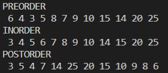
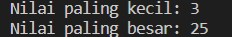
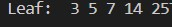
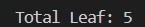
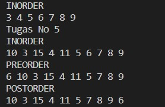

# Laporan Praktikum Pertemuan 14
## Kholid Maulidi
## 1G/ 16/ 2141720139

# subbab 2.1.2
1. Mengapa dalam binary search tree proses pencarian data bisa lebih efektif
dilakukan dibanding binary tree biasa?
* karena pada Binary Search Tree terdapat aturan bahwa setiap child node sebelah kiri selalu lebih kecil nilainya dari pada root node. Setiap child node sebelah kanan selalu lebih besar nilainya daripada root node, maka dari itu hal ini efisien di dalam proses searching

2. Untuk apakah di class Node, kegunaan dari atribut left dan right?

* untuk menentukan leftchild dan reightchild. 

3. a.  Untuk apakah kegunaan dari atribut root di dalam class BinaryTree?

	**kegunaan dari root adalah untuk menentukan nilai paling atas**
   
   b. Ketika objek tree pertama kali dibuat, apakah nilai dari root?
   
	**null atau kosong**

4. Ketika tree masih kosong, dan akan ditambahkan sebuah node baru, proses apa yang akan terjadi?

* proses penginputan node ke dalam root

5. Perhatikan method add(), di dalamnya terdapat baris program seperti di bawah 
ini. Jelaskan secara detil untuk apa baris program tersebut?
        
        if(data<current.data){
        if(current.left!=null){
        current = current.left;
        }else{
        current.left = new Node(data);
        break;
        }
 
 
* jika data baru kurang dari data sebelumnya maka akan di lakukan pengecekan, apakah data 
kiri bernilai sama dengan null, jika iya, data lama akan masuk ke dalam data kiri, 
jika tidak, maka data kiri di ganti dengan data yang baru saja di input, setelah itu akan dilakukan proses break

## subbab 13.2.1
1.  Apakah kegunaan dari atribut data dan idxLast yang ada di class BinaryTreeArray?

* untuk mendeklarasikan banyaknya nilai array dan IdxLast untuk menentukan alamat data

2. Apakah kegunaan dari method populateData()?

* untuk menginput data agar dikenali indexnya

3. Apakah kegunaan dari method traverseInOrder()?

* untuk menampilkan data secara inOrder atau mengemenampilkan seluruh data pada tree secara rekursif mulai dari sebelah kiri

4. Jika suatu node binary tree disimpan dalam array indeks 2, maka di indeks berapakah posisi left child dan rigth child masin-masing?

* left = 1 dan right 3
	
5. Apa kegunaan statement int idxLast = 6 pada praktikum 2 percobaan nomor 4?

* sebagai batas index agar hanya menjadi 6

## Tugas
1. 

2. 

3. 

4. 

5. 

	
	

