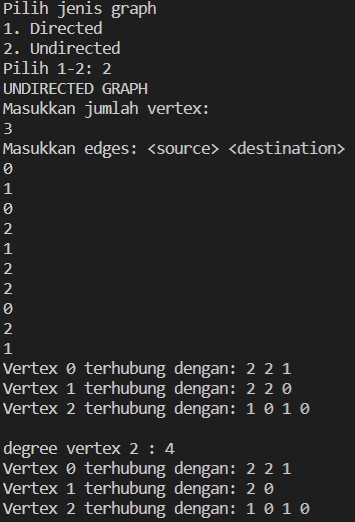

# Pertemuan 15
## Kholid Maulidi
## 16/ 1G/ 2141720139

## subbab 2.1.3
Pertanyaan

1. Sebutkan beberapa jenis (minimal 3) algoritma yang menggunakan dasar Graph, dan apakah
kegunaan algoritma-algoritma tersebut?
- Algoritma Bellman-Ford Untuk mencari lintasan terpendek
- Algoritma Boruvska Untuk menentukan pohon penjangkau minimum
- Pencarian Melebar (Breadth First Search atau BFS) Untuk searching
- Pencarian Mendalam (Depth First Search atau DFS) Untuk searching

2. Pada class Graph terdapat array bertipe LinkedList, yaitu LinkedList list[]. Apakah tujuan 
pembuatan variabel tersebut ?
* Untuk memanggil objek Linkedlist (diubah menjadi objek array) yang mana 
nantinya akan di isi oleh vertex

3. Apakah alasan pemanggilan method addFirst() untuk menambahkan data, bukan method add 
jenis lain pada linked list ketika digunakan pada method addEdge pada class Graph? 
* Agar data dari depan dapat dikenal (pengenalan

4. Bagaimana cara mendeteksi prev pointer pada saat akan melakukan penghapusan suatu edge 
pada graph ?
* Caranya adalah menggunakan looping edge, dengan kondisi jika vertex lebih besar dari I dan destination sama dengan I maka 
edge akan otomatis di hapus

5. Kenapa pada praktikum 12.2 langkah ke-12 untuk menghapus path yang bukan merupakan 
lintasan pertama kali menghasilkan output yang salah ? Bagaimana solusinya ?

* data vertex yang di keluarkan mengalami perubahan path / lintasan

## subbab 2.2.3
Pertanyaan

1. Apakah perbedaan degree/derajat pada directed dan undirected graph?
* Degree/derajat pada directed graph tidak sama dan tidak selalu berhubungan kembali dengan vertices. Sedangkan undirected graph memiliki degree yang sama dan pasti berhubungan kembali dengan vertices.

2. Pada implementasi graph menggunakan adjacency matriks. Kenapa jumlah vertices harus
ditambahkan dengan 1 pada indeks array berikut?

* Karena pada matriks index di mulai dari 0, agar vertex dalam matrix bernilai sama dengan 
vertex yang seharusnya maka harus di tambah +1

3. Apakah kegunaan method **getEdge()** ?
* Kegunaan method getEdge() adalah untuk melakukan pencarian dan mengeluarkan output keterangan apakah edge yang dicari tersebut terdapat dalam graph atau tidak

4. Termasuk jenis graph apakah uji coba pada praktikum 12.3 ?

* directed graph

5. Mengapa pada method main harus menggunakan try-catch Exception ?

* Agar program yang error dapat tetap berjalan dan tidak terhenti

## Tugas

1. 

2. 
 

3. 

4. 
