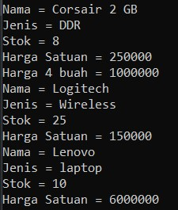
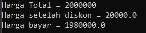
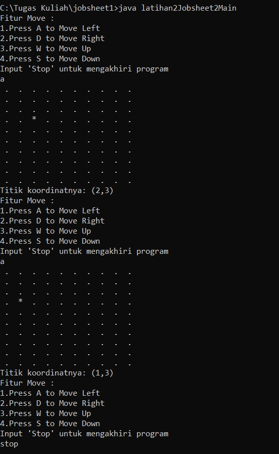

## subbab 2.2

pertanyaan
1. object : memiliki nilai yang spesifik
    
    class : bersifat umum 
2. diawali dengan "class" dan "nama class"
3. 4 atribut, String namaBarang, jenisBarang dan int stok, hargaSatuan. deklarasi atribut dilakukan pada baris 13 dan 14
4. 4 method, void tampilBarang() , void tambahStok() , void kurangiStok() , int hitungHargaTotal() . deklarasi method dilakukan pada baris 16, 23, 27 dan 31
5.      void kurangiStok(int n){
            if (stok>0){
                stok = stok -n;
            }
        }
6. sebagai patokan nilai n (penyimpan nilai n)
7. karena hasil returnnya bertipe integer
8. karena void tipe data kosong dan method tersebut tidak memiliki return

## subbbab 2.3

pertanyaan 
1. pada baris 15 dengan nama objek "b1'
2. cara mengakses objek : 
namaObjek.namaAtribut = nilai;

    cara mengakses method : namaObjek.namaMethod();

## subbab 2.4 

pertanyaan
1. pada baris 18
2. Instansiasi konstruktor berparameter dengan nama objek baru yaitu b2
3. barang b3 = new barang("Lenovo", "laptop", 10, 6000000);
		b3.tampilBarang();

## Output Program 
1. Praktikum
    

2. Latihan1 

3. latihan2

