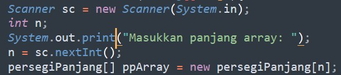
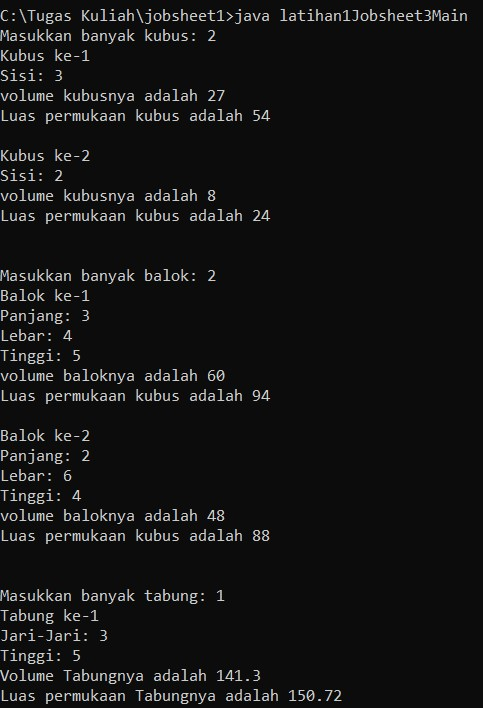
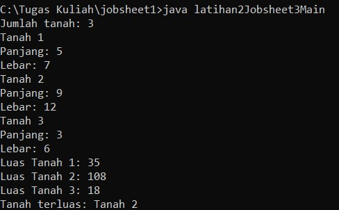
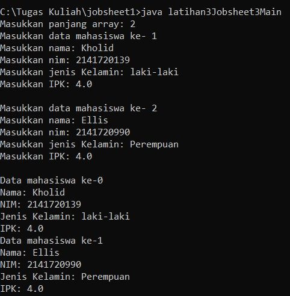

## subbab 3.2
Pertanyaan

1. iya, karena harus memiliki object tapi tidak harus memiliki method
2. untuk membuat object persegiPanjang pada 
ppArray index ke-1
3. membuat ppArray menampung 3 objek PersegiPanjang 
4.  menginstansiasikan array(membuat objek PersegiPanjang  ke index array 1
    dan mengisi atribut array index 1)
5. agar lebih fleksibel dan mampu mempresentasikan class dan objek itu sendiri

## subbab 3.3
pertanyaan

1. bisa
2.      tumbuhan[][] tm = new tumbuhan[1][1];
        tm[0][0] = new tumbuhan();

3. karna tidak membuat object terlebih dahulu
4.  
5. boleh, program tidak terjadi error tetapi kurang efektif dan efisien ketika digunakan

## subbab 3.4
Pertanyaan

1. **bisa**

        public class workout{
            int repetisi;

            public workout(){

            }
            public workout(int w){
                workout = w;
            }
        }
    **kode diatas adalah contoh konstruktor berparameter dan tidak berparameter**

2.      class segitiga{
	        public int alas;
	        public int tinggi;

	    public segitiga(int a, int b){
		alas = a;
		tinggi = b;
	    }
3.      public double hitungLuas(){
		    return (alas*tinggi) *0.5;
		}

	    public double hitungKeliling(double a, double b){
		    double c = Math.sqrt((a*a)+(b*b));
		    double keliling = a+b+c;
		    return keliling;
	        }
        } 
4.      segitiga[] sgArray = new segitiga[4];
		sgArray[0] = new segitiga(10, 4);
		sgArray[1] = new segitiga(20, 10);             
		sgArray[2] = new segitiga(15, 6);
		sgArray[3] = new segitiga(25, 10);
5.      for(int i=0; i<4; i++){
		    System.out.println("segitiga ke" + (i+1));
		    System.out.println("luasnya adalah " + sgArray[i].hitungLuas()  + "    dan kelilingnya adalah " + sgArray[i].hitungKeliling(sgArray[i].alas, sgArray[i].tinggi));
		}    

## Latihan (Code dan Output)
## Latihan 1
        
    import java.util.Scanner;
    class kubus{
	    int sisi;
	
	int hitungLuasP(){
		int luasP = 6*(sisi*sisi);
		return luasP;
	}
	int hitungVolume(){
		int vol = sisi*sisi*sisi;
		return vol;
	}
    }

    class balok{
	    int p, l, t;

	int hitungLuasPB(){
		int luasPB = 2*((p*l)+(p*t)+(l*t));
		return luasPB;
	}
	int hitungVolumeB(){
		int volumeB = p*l*t;
		return volumeB;
	}
    }

    class tabung{
	    double jariJari, tinggi;

	    double hitungLPT(){
		double luasLPT = 2*3.14*jariJari*(jariJari+tinggi);
		return luasLPT;
	}

	double hitungVolumeT(){
		double volumeT = 3.14*(jariJari*jariJari)*tinggi;
		return volumeT;
	}
    }
    public class latihan1Jobsheet3Main{
	    public static void main(String[] args){
		    Scanner sc = new Scanner(System.in);
		    int x, y, z;
		    System.out.print("Masukkan banyak kubus: ");
		    x = sc.nextInt();
		    kubus k1[] = new kubus[x];
		    for(int i=0; i<k1.length; i++){
			    k1[i] = new kubus();
			    System.out.println("Kubus ke-" + (i+1));
			    System.out.print("Sisi: ");
			    k1[i].sisi = sc.nextInt();
			    System.out.println("volume kubusnya adalah " + k1[i].hitungVolume());
			    System.out.println("Luas permukaan kubus adalah " + k1[i].hitungLuasP());
			    System.out.println(" ");
		    }

		    System.out.println(" ");

		    System.out.print("Masukkan banyak balok: ");
		    y = sc.nextInt();
		    balok b1[] = new balok[y];
		    for(int i=0; i<b1.length; i++){
			    b1[i] = new balok();
			    System.out.println("Balok ke-" + (i+1));
			    System.out.print("Panjang: ");
			    b1[i].p = sc.nextInt();
			    System.out.print("Lebar: ");
			    b1[i].l = sc.nextInt();
			    System.out.print("Tinggi: ");
			    b1[i].t = sc.nextInt();
			    System.out.println("volume baloknya adalah " + b1[i].hitungVolumeB());
			    System.out.println("Luas permukaan kubus adalah " + b1[i].hitungLuasPB());
			    System.out.println(" ");
		    } 
		
		    System.out.println(" ");

		    System.out.print("Masukkan banyak tabung: ");
		    z = sc.nextInt();
		    tabung t1[] = new tabung[z];
		    for(int i=0; i<t1.length; i++){
			    t1[i] = new tabung();
			    System.out.println("Tabung ke-" + (i+1));
			    System.out.print("Jari-Jari: ");
			    t1[i].jariJari = sc.nextDouble();
			    System.out.print("Tinggi: ");
			    t1[i].tinggi = sc.nextDouble();
			    System.out.println("Volume Tabungnya adalah " + t1[i].hitungVolumeT());
			    System.out.println("Luas permukaan Tabungnya adalah " + t1[i].hitungLPT());
			    System.out.println(" ");
		    }
		
	        }
            }

## Latihan 2
    import java.util.Scanner;
    class latihan2Jobsheet3{
	    int panjang;
	    int lebar;

	int hitungLuas(){
		int luas = panjang* lebar;
		return luas;
	}
    }

    public class latihan2Jobsheet3Main{
	    public static void main(String[] args){
		    Scanner sc = new Scanner(System.in);
		    int n;
		    System.out.print("Jumlah tanah: ");
		    n = sc.nextInt();
		    latihan2Jobsheet3[] tnArray = new latihan2Jobsheet3[n];
		
		    for(int i=0; i<n; i++){
			    tnArray[i] = new latihan2Jobsheet3();
			    System.out.println("Tanah " + (i+1));
			    System.out.print("Panjang: ");
			    tnArray[i].panjang = sc.nextInt();
			    System.out.print("Lebar: ");
			    tnArray[i].lebar = sc.nextInt();
		    }

		    for(int i=0; i<tnArray.length; i++){
			System.out.println("Luas Tanah " + (i+1) + ": " + tnArray[i].hitungLuas());
		    }

		    int max = 0;
		    int j = 0;
		    for(int i=0; i<tnArray.length; i++){
			    if(tnArray[i].hitungLuas() > max){
				    max = tnArray[i].hitungLuas();
				    j = i+1;
			}
		    }
		    System.out.println("Tanah terluas: Tanah " + j); 
	    }
    }

## latihan 3
    import java.util.Scanner;
    class latihan3Jobsheet3{
	    String nama, jenisKelamin;;
	    int nim;
	    double ipk;
    }

    public class latihan3Jobsheet3Main{
	    public static void main(String[] args){
		    Scanner sc = new Scanner(System.in);
		    int n;
		    System.out.print("Masukkan panjang array: ");
		    n = sc.nextInt();
		    latihan3Jobsheet3[] mhArray = new latihan3Jobsheet3[n];

		    for(int i=0; i<n; i++){
			    mhArray[i] = new latihan3Jobsheet3();
			    System.out.println("Masukkan data mahasiswa ke- " + i);
			    System.out.print("Masukkan nama: ");
			    mhArray[i].nama = sc.next();
			    System.out.print("Masukkan nim: ");
			    mhArray[i].nim = sc.nextInt();
			    System.out.print("Masukkan jenis Kelamin: ");
			    mhArray[i].jenisKelamin = sc.next();
			    System.out.print("Masukkan IPK: ");
			    mhArray[i].ipk = sc.nextDouble();
			    System.out.println(" ");
		    }

		    for(int i=0; i<mhArray.length; i++){
			    System.out.println("Data mahasiswa ke-"+i);
			    System.out.println("Nama: " + mhArray[i].nama);
			    System.out.println("NIM: " + mhArray[i].nim);
			    System.out.println("Jenis Kelamin: " + mhArray[i].jenisKelamin);
			    System.out.println("IPK: " + mhArray[i].ipk);
		    }
	    }
    }

