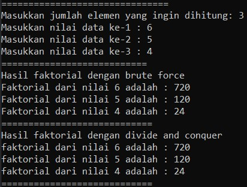
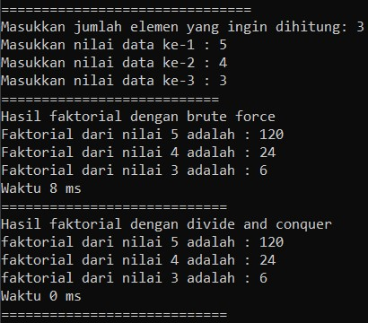
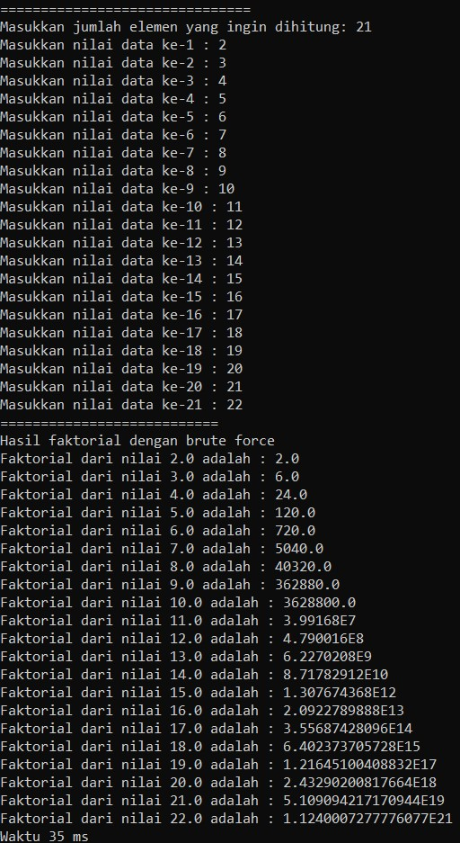
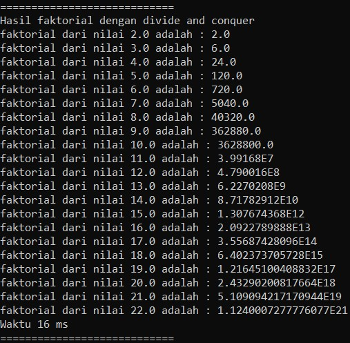

## subbab 4.2
pertanyaan 
1. Karena jika nilai dari n sudah equals atau sama dengan1, maka program akan 
melakukan return 1, kemudian jika tidak maka nilai daripada variable n akan di kurang -
1,yang mana di setiap loop atau perulangan yang di lakukan pada method di kalikan 
dengan nilai sebelumnya dan kemudian program akan mereturn pada variable fakto
2. • Divide = faktorialDC(n-1) pengurangan pada nilai n. 
• Conquer = n*.faktorialDC(n-1) penyelesaian dengan rekursif. 
• Combine = n*faktorialDC(n-1) pengombinasian dengan perkalian.
3. 
	
		import java.util.Scanner;
		class faktorial{
		public int nilai;

		public int faktorialBF(int n){
		int fakto =1;
		int i=1;
		while(i<=n){
			fakto = fakto*i;
			i++;
		}
		return fakto;
		}

		public int faktorialDC(int n){
		if(n==1){
			return 1;
		}
		else{
			int fakto =n * faktorialDC(n-1);
			return fakto;
		}
		}
		}

		public class faktorialMain{
		public static void main(String[] args){
			Scanner sc = new Scanner(System.in);
			System.out.println("===============================");
			System.out.print("Masukkan jumlah elemen yang ingin dihitung: ");
			int elemen = sc.nextInt();
			faktorial[] fk = new faktorial[elemen];
			for(int i =0; i<elemen; i++){
			fk[i] = new faktorial();
			System.out.print("Masukkan nilai data ke-"+(i+1)+" : ");
			fk[i].nilai = sc.nextInt();
			}
			System.out.println("===========================");
			System.out.println("Hasil faktorial dengan brute force");
			for(int i=0; i<elemen; i++){
				System.out.println("Faktorial dari nilai "+fk[i].nilai+" adalah : "+fk[i].faktorialBF(fk[i].nilai));
			}
			System.out.println("============================");
			System.out.println("Hasil faktorial dengan divide and conquer");
			for(int i=0; i<elemen; i++){
		 		System.out.println("faktorial dari nilai "+fk[i].nilai+" adalah : "+fk[i].faktorialDC(fk[i].nilai));
			}
			System.out.println("============================");
			}
			}
	
	

4. 
		public class faktorialMain{
			public static void main(String[] args){
				Scanner sc = new Scanner(System.in);
				System.out.println("===============================");
				System.out.print("Masukkan jumlah elemen yang ingin dihitung: ");
				int elemen = sc.nextInt();
				faktorial[] fk = new faktorial[elemen];
				for(int i =0; i<elemen; i++){
					fk[i] = new faktorial();
					System.out.print("Masukkan nilai data ke-"+(i+1)+" : ");
					fk[i].nilai = sc.nextInt();
				}
				long start = System.currentTimeMillis();
				System.out.println("===========================");
				System.out.println("Hasil faktorial dengan brute force");
				for(int i=0; i<elemen; i++){
					System.out.println("Faktorial dari nilai "+fk[i].nilai+" adalah : "+fk[i].faktorialBF(fk[i].nilai));
				}
				long end = System.currentTimeMillis();
				long elapsedtime = end-start;
				System.out.println("Waktu " + String.valueOf(elapsedtime)+ " ms");
				long start1 = System.currentTimeMillis();
				System.out.println("============================");
				System.out.println("Hasil faktorial dengan divide and conquer");
				for(int i=0; i<elemen; i++){
		 			System.out.println("faktorial dari nilai "+fk[i].nilai+" adalah : "+fk[i].faktorialDC(fk[i].nilai));
				}
				long end1 = System.currentTimeMillis();
				long elapsedtime1 = end1-start1;
				System.out.println("Waktu " + String.valueOf(elapsedtime1)+ " ms");
				System.out.println("============================");
			}
		}
		
	

5. ada

## subbab 4.3
pertanyaan
1. Perbedaan dari method PangkatBF() dan PangkatDC yakni pada method pangkatBF() menggunakan fungsi iterative (fungsi yang melakukan perulangan yang melakukan proses perulangan terhadap sekelompok intruksi. Perulangan dilakukan dalam batasan syarat tertentu. Ketika syarat tersebut tidak terpenuhi lagi maka perulangan akan terhenti) sedangkan pada method pangkatDC() menggunakan fungsi rekursif yang 
mana pada fungsi ini perulangan yang terjadi akibat pengeksekusian suatu fungsi yang mana fungsi tersebut memanggil dirinya sendiri.
2. Maksud dari potongan tersebut yakni apabila terdapat suatu bilangan ganjil maka program akan melakukan pembagian terhadap variuable n, yakni di bagi 2 kemudian dikalikan dengan method itu sendiri dan kemudian di kalikan lagi dengan variable a. namun apabila terdapat suatu bilangan genap maka program akan melakukan return/nilai balik dan di dalam return tersebut dilakukan pembagian terhadap variable 
n, yang mana variable n di bagi 2 dan kemudian di kalikan dengan method itu sendiri namun tidak dikalikan dengan nilai daripada variable a.
3. Tahap combine sudah terjadi pada kode tersebut, dan lebih tepatnya tahapan tersebut di lakukan pada class Pangkat yang mana lebih tepatnya terletak pada method pangkatDC dan berada di baris kode ke 46
4. NO 4 DAN 5
	import java.util.Scanner;
	class pangkat{
	public int nilai, pangkat;

	pangkat(int n, int p){
		nilai= n;
		pangkat =p;
	}

	public int pangkatBF(int a, int b){
		int hasil =1;
		for(int i =0; i<b; i++){
			hasil = hasil *a;
		}
		return hasil;
	}

	public int pangkatDC(int a, int b){
		if(b==0){
			return 1;
		} else{
			if(b%2==1){
				return (pangkatDC(a, b/2)*pangkatDC(a, b/2)*a);
			} else {
				return (pangkatDC(a, b/2)*pangkatDC(a, b/2));
			}
			}
		}
	}

		public class pangkatMain{
			public static void main(String [] args){
			Scanner sc = new Scanner(System.in);

		System.out.println("======================================");
		System.out.print("Masukkan jumlah elemen yang ingim dihitung: ");
		int elemen = sc.nextInt();
		pangkat[] p1 = new pangkat[elemen]; 
		for(int i=0; i<elemen; i++){
			System.out.print("Masukkan nilai yang akan dipangkatkan: ");
			int bil = sc.nextInt();
			System.out.print("Masukkan nilai pemangkat ke-" + (i+1) + " : ");
			int png = sc.nextInt();
			p1[i] = new pangkat(bil, png);
		}
		int noFitur;
       
    	System.out.println("Fitur-fitur : \n(01) Fitur Hitung menggunakan Brute Force\n(02) Fitur Hitung menggunakan Divide Conquer");
   	 	System.out.println("\nSilahkan Pilih Fitur dengan Memasukkan Nomor Fitur :");
    	System.out.println("(Inputkan angka 00 untuk mengakhiri program)");
       
    	noFitur = sc.nextInt();
    	System.out.println(" ");
        
    	if(noFitur==01){
        	System.out.println("=======================================");
			System.out.println("Hasil pangkat dengan Brute Force");
			for(int i=0; i<elemen; i++){
			System.out.println("Nilai " + p1[i].nilai + " pangkat "+ p1[i].pangkat + " adalah " + p1[i].pangkatBF(p1[i].nilai, p1[i].pangkat));
			}
    	}else if(noFitur==02){
        	System.out.println("=======================================");
			System.out.println("Hasil pangkat dengan Divide Conquer");
			for(int i=0; i<elemen; i++){
			System.out.println("Nilai " + p1[i].nilai + " pangkat "+ p1[i].pangkat + " adalah " + p1[i].pangkatDC(p1[i].nilai, p1[i].pangkat));
			}
    	}else if(noFitur==03){
        
    	}else{
        System.out.println("Nomor fitur yang Anda masukkan invalid!\n");
    	}
		
		System.out.println("=======================================");
	}
}

## subbab 4.4
pertanyaan 
1. a. totalBF(), kode program lebih sederhana dan lebih mudah dimengerti
b. totalDC(), kode program lebih panjang tetapi dengan metode ini bisa menyelesaikan persoalan yang sulit dan efesiensi algoritma yang tinggi
2. Dengan cara mengganti syntax println menjadi syntax printf dan juga teknik pembatasan karakter

	System.out.printf("%2f", "Total keuntungam selama "+sm.elemen+" bulan adalah : "+sm.totalBF(sm.keuntungan));

3. Return value tersebut berguna untuk mengembalikan nilai dari variable lsum ,variable rsum dan juga arr [mid] yang mana masing-masing nya dijumlahkan terlebih dahulu.
4. Di butuhkan variable mid pada method TotalDC() yakni guna menampng nilai 
dari perhitungan (1+r)/2 yang mana nantinya akan digunakan sebagai pengisian nilai pada parameter di method TotalDC()
5.  		import java.util.Scanner;
		class sum{
			int elemen[];
			int perusahaan[];
			double keuntungan[];
			double total;

			sum(int elemen, int jumPrs){
				this.elemen = new int [elemen];
				this.keuntungan = new double[elemen];
				this.perusahaan = new int[jumPrs];
				this.total = 0;
			}

			double totalBF(double arr[]){
				for(int i=0; i<elemen.length; i++){
					total = total + arr[i];
				}
				return total;
			}

			double totalDC(double arr[], int l, int r){
			if(l== r){
				return arr[l];
			} else if(l<r){
				int mid = (l+r)/2;
				double lsum = totalDC(arr, l, mid-1 );
				double rsum = totalDC(arr, mid+1, r);
				return lsum+rsum+arr[mid];
			}	
			return 0;
			}
		}

		public class sumMain{
			public static void main(String[] args){
				Scanner sc = new Scanner(System.in);

				int el =0;

				System.out.println("=======================================================");
				System.out.println("Hitung Keuntungan Total");

		
				System.out.print("Masukkan jumlah perusahaan: ");
        			int jmlhPrs= sc.nextInt();
        			for(int i=0; i<jmlhPrs; i++){
            			System.out.print("Masukkan jumlah bulan perusahaan ke-" +(i+1)+ " : ");
            			int elm= sc.nextInt();
           		 	el= elm;
       				}
        			sum sm = new sum(el,jmlhPrs);
        			System.out.println("=========================================================");
        			for(int i=0; i<jmlhPrs; i++){
            			System.out.println("Keuntungan Perusahaan " +(i+1));
            			for(int j=0; j<el; j++){
                			System.out.print("Masukkan keuntungan perusahaan bulan ke -" +(j+1)+" = ");
                			sm.keuntungan[j]= sc.nextDouble();
            			}
        			}

        			for(int i=0; i<jmlhPrs;i++){
            				System.out.println("==========================================================");
            				System.out.println("Keuntungan Perusahaan " + (i+1));
            				System.out.println("Algoritma Brute Force");
            		System.out.printf("Total keuntungan perusahaan ke-" + (i+1)+" selama " + sm.elemen[i] + " bulan adalah = " +sm.totalBF(sm.keuntungan));
            		System.out.println("\n==========================================================");
            		System.out.println("Algoritma Divide Conquer");
            System.out.println("Total keuntungan perusahaan ke-" + (i+1)+" selama " + sm.elemen[i] + " bulan adalah = " +sm.totalDC(sm.keuntungan, 0, sm.elemen[i]-1));
        		}
			}
		}
