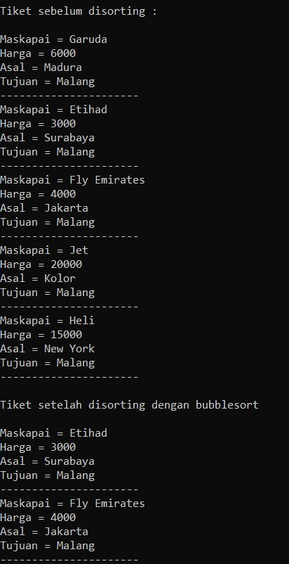
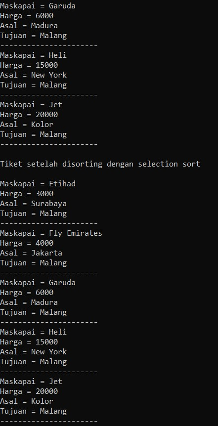

## subbab 5.2
Pertanyaan

1. bubbleSort();
2. belum ada (ada di langkah praktikum berikutnya)
3.      mahasiswa tmp = listMhs[j];
		listMhs[j] = listMhs[j-1];
		listMhs[j-1] = tmp;

4. untuk melakukan proses swap
5. a. **karna index 1 dianggap sebagai nilai awal untuk dibandingkan**
   
   b.**karena ada perulangan J yang mengeloop sampai listmhs, saat i = 0 maka akan di loop sampai array.length - 0  yang berarti di loop j pertama dari 1 sampai array.length** 
   
   c. **karena untuk membandingkan dengan array i**
   
   d. **49 for dan 1225 tahapan**

## subbab 5.3
1. untuk mencari nilai terkecil dan diswap dengan angka yang disebelah kirinya sebelum pengurutan 

## subbab 5.4
**class**
      
      void insertionSort(boolean asc){
		      for(int i=1; i<listMhs.length; i++){
			      mahasiswa temp = listMhs[i];
			      int j =i;
			   if(asc){
				   while(j>0 && listMhs[j-1].ipk > temp.ipk){
					   listMhs[j] = listMhs[j-1];
					   j--;
				   }
			   } else {
				   while(j>0 && listMhs[j-1].ipk < temp.ipk){
					   listMhs[j] = listMhs[j-1];
					   j--;
				   }
			   }
			   listMhs[j] = temp;
		   }
	   }
**Main**
         
         System.out.println("Data mahasiswa setelah disorting dengan InsertionSort berdasarkan ipk = ");
		   list.insertionSort(true);
		   list.tampil();

## latihan

